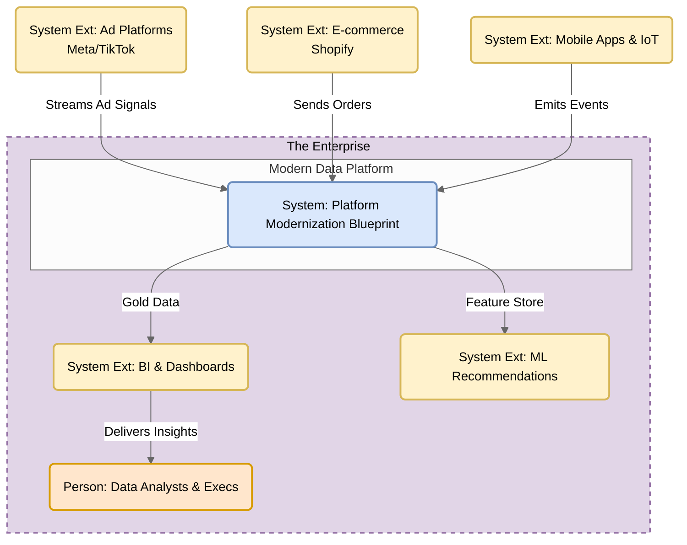
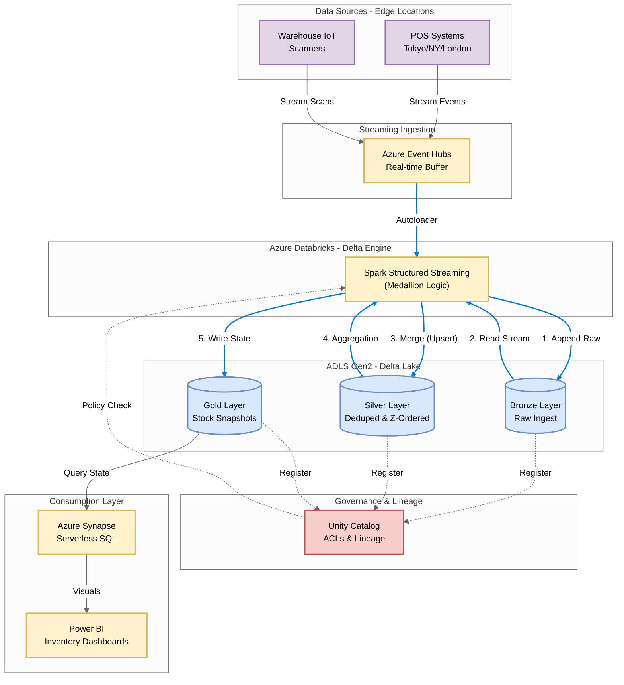

# Azure Module: Real-Time Dynamic Inventory Mesh

## 1. Executive Summary & Problem Statement
**The Challenge:** Inventory data is often "eventually consistent," leading to overselling.
**The Solution:** A Data Mesh node on Azure Databricks.

## 2. Medallion Architecture Implementation
* **Bronze:** Ingest raw inventory change logs.
* **Silver:** Deduplicate events (handling retries) and optimize storage (Z-Ordering).
* **Gold:** Aggregate changes to produce a real-time "Stock on Hand" snapshot for the website.

### Azure Architecture: Real-Time Inventory Mesh

### Azure Architecture: Real-Time Inventory Mesh

### System Context Diagram: Platform Modernization Blueprint

Section 2
### Azure Architecture: Real-Time Inventory Mesh

## 3. How to Run
1.  `cd azure_implementation`
2.  `python databricks_delta_job.py`
