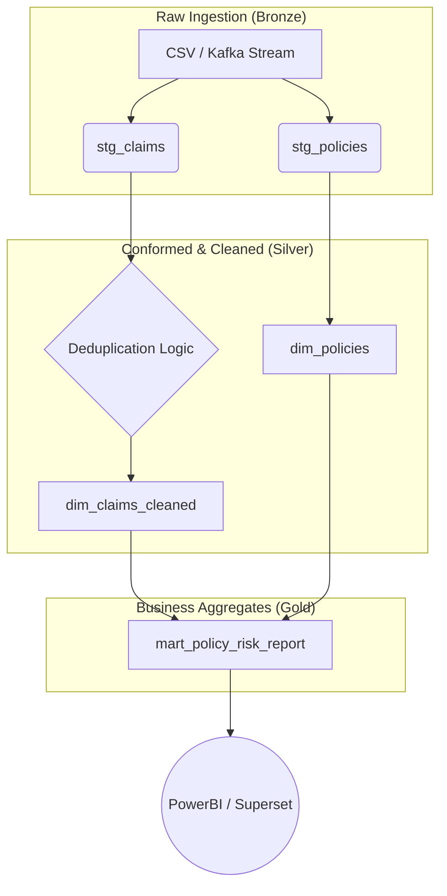

# 🛡️ Project Polaris: Insurance Data Platform Modernization

**Role Simulation:** Senior Data Engineer (Analytics)  
**Tech Stack:** Python, SQL, dbt Core, Spark (simulated), Medallion Architecture

---

## 🚩 1. Problem Statement
The legacy data system at GEICO suffers from **"The Dirty Lake"** problem:
1.  **Duplicate Data:** Real-time ingestion pipelines often re-send claim events, causing duplicate records in reports.
2.  **Inconsistent formatting:** `status` fields are mixed case ('Open', 'OPEN', 'open'), breaking BI filters.
3.  **Slow Reporting:** Analysts are querying raw log files, leading to hour-long wait times for basic risk reports.

## 🛠️ 2. The Solution Architecture
We implemented a **Medallion Architecture (Bronze/Silver/Gold)** using **dbt** to modularize transformations and ensure data quality.



## 🚀 3. Technical Highlights (How to Demo)

### A. Handling Duplicates (The "Idempotency" Fix)
In `models/silver/dim_claims_cleaned.sql`, we utilize Window Functions (ROW_NUMBER()) to handle the "At-Least-Once" delivery guarantee of distributed systems (like Kafka).

```sql
row_number() over (partition by claim_id order by ingestion_time desc)
```

This ensures that even if the pipeline runs twice, the downstream report only counts the claim once.

### B. Standardization
We moved cleaning logic upstream to the Silver layer.

- **Before:** investigation, PENDING, Pending
- **After:** INVESTIGATION, PENDING

**Impact:** Zero-downtime reporting. The dashboard no longer breaks when a new casing format is introduced.

## 🏃 4. How to Run This Project
1. **Generate Data:** Run the python data generation script.
2. **Setup Seeds:** Copy the generated CSVs from `data/` to `dbt_project/seeds/`.
3. **Load Seeds:** `dbt seed`
4. **Run Pipeline:** `dbt run`
5. **Test Quality:** `dbt test` (Checks for uniqueness and referential integrity)

This blueprint demonstrates the shift from Legacy ETL to Modern Analytics Engineering.