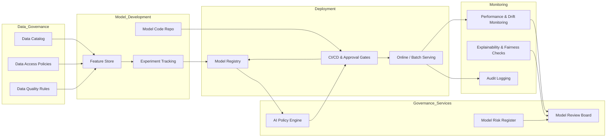

# AI and ML governance architecture

This diagram represents a **governed ML lifecycle** that balances innovation speed with control, ensuring models are compliant, monitored, and auditable.

## Governance narrative

**Scope:** All production ML models, including classical ML, deep learning, and LLM-powered systems, are governed through a consistent framework.

**Key principles:**
- **Single source of truth for models:** Model Registry holds lineage from data to code to deployed artifact.
- **Policy as code:** AI policies (e.g., fairness thresholds, prohibited use cases, data residency) are enforced automatically through a policy engine in CI/CD.
- **Documented risk posture:** Each model has a risk tier, approved use cases, and owners, stored in a Model Risk Register.
- **Continuous monitoring:** Performance, drift, and fairness metrics are tracked, with alerts feeding into a model review board for remediation decisions.

## Director-level responsibilities

- Define the **governance operating model** (roles, RACI, review cadence).
- Drive **platform integration** between data catalog, CI/CD, model registry, and monitoring.
- Enforce **minimal but strong** controls that enable teams rather than blocking them.
