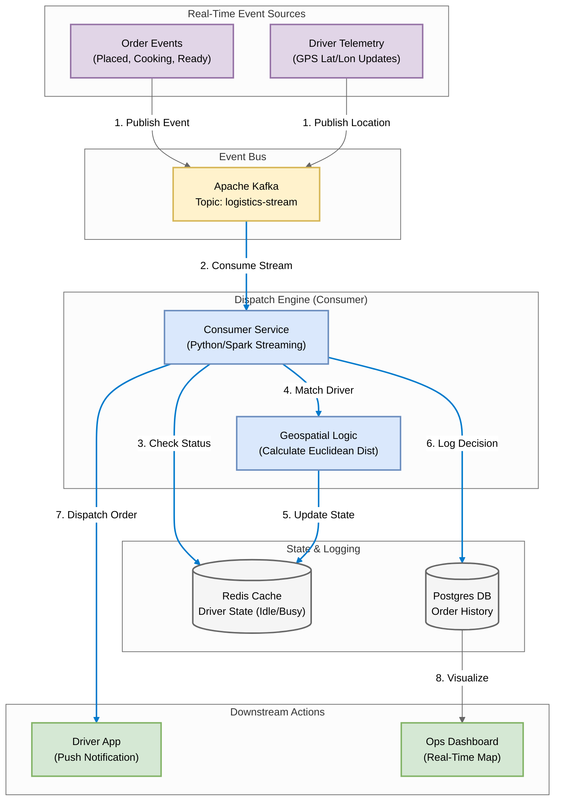

# DoorDash Style: Real-Time Logistics & Delivery Matching

## 1. Problem Statement
In food delivery, milliseconds matter. A delay in matching a 'Ready' order to a nearby driver results in cold food and customer churn. We need a system that ingests thousands of order events and driver GPS pings to optimize dispatch in real-time.

## 2. Requirements & KPIs
- Ingest 2 distinct streams: Order Events (Placed/Cooking/Ready) and Driver Telemetry (GPS).
- Latency: Driver matching must occur within 30 seconds of 'Order Ready'.
- Data Integrity: Cannot lose 'Order Placed' events (At-Least-Once delivery).
- Scalability: Handle spikes during Dinner Rush (6pm - 8pm).

## 3. Architecture & Pipeline
1. **Producer (`producer.py`)**: Simulates a dual-stream of data:
   - *Orders*: {Order ID, Restaurant Loc, Status, Timestamp}
   - *Drivers*: {Driver ID, Current GPS, Status (Idle/Busy)}
2. **Ingestion**: Kafka Topic `logistics-stream`.
3. **Processing (`consumer.py`)**: 
   - Filters for 'Status: Ready' events.
   - Calculates Euclidean distance to nearest 'Idle' driver.
4. **Logging**: Uses `utils_logger.py` to track dispatch decisions.

---

## 4. Technical Implementation

### File Structure
- `producer.py`: Generates mock orders and driver GPS pings.
- `consumer.py`: The "Dispatch Engine" that processes the stream.
- `utils_logger.py`: Standardized logging for audit trails.
- `.env`: Configuration for Database and Kafka connections.

### Architecture Diagram: DoorDash Logistics Pipeline




### How to Run this Demo

**Step 1: Install Dependencies**
```bash
pip install -r requirements.txt
```

**Step 2: Start the Dispatch Engine (Consumer)**
Open a terminal and run:
```bash
python consumer.py
```
*You will see the consumer waiting for 'Order Ready' events...*

**Step 3: Start the Simulation (Producer)**
Open a second terminal and run:
```bash
python producer.py --mode=delivery_rush
```

**Step 4: Observe the Logs**
Watch the Consumer terminal. You should see logic similar to:
`[INFO] Order #1024 is READY at [47.6, -122.3]`
`[INFO] Dispatching Driver #55 to Order #1024 (Distance: 0.5 miles)`

---
*i used sythetic data for this usecase | DoorDash Style: Real-Time Logistics & Delivery Matching Project*
