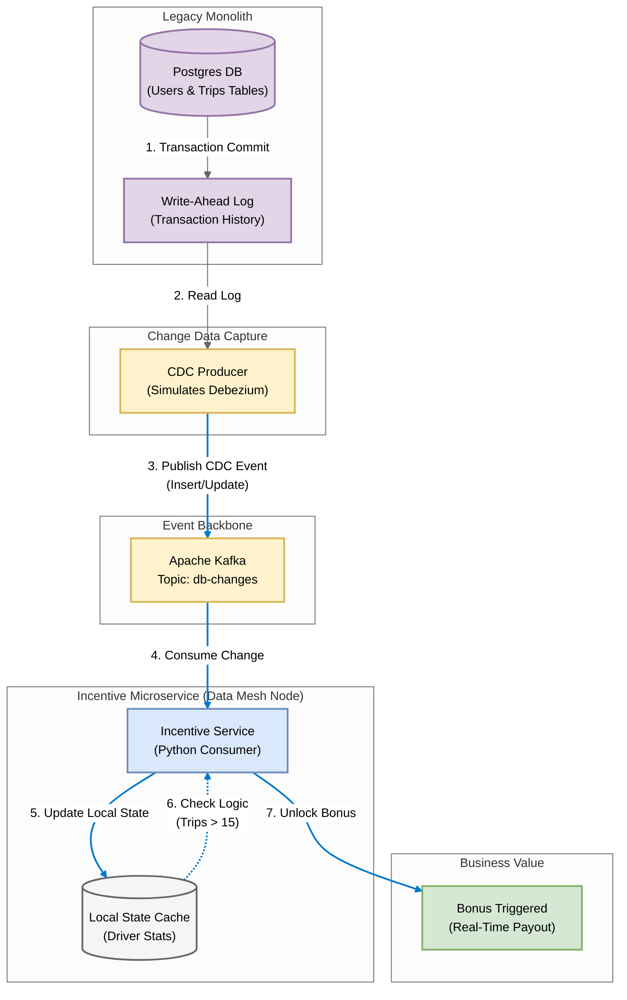

# Uber Style: CDC Data Mesh (Change Data Capture)

## 1. Problem Statement
In a massive monolith (like Uber's early days), querying the main database for analytics or driver incentives slows down the app for everyone. We need to 'stream' database changes instantly to microservices without hitting the main database with heavy queries.

## 2. Requirements & KPIs
- Uncouple Microservices: The Incentive Service should not query the Main DB directly.
- Real-Time: Database changes (Inserts/Updates) must propagate in < 500ms.
- Event Format: Use standard CDC format (Operation, Before, After).
- Business Logic: Instantly trigger 'Bonus Unlocked' events when thresholds are met.

## 3. Architecture & Pipeline
1. **Source (Monolith)**: PostgreSQL Database (Users, Trips).
2. **Capture (Producer)**: Simulates Debezium reading the Write-Ahead Log (WAL).
3. **Transport**: Kafka Topic `db-changes.public.drivers`.
4. **Sink (Consumer)**: Incentive Service builds a local 'Mesh' state to calculate bonuses.

---

## 4. Technical Implementation

### File Structure
- `producer.py`: Simulates the CDC Process (Debezium) emitting WAL events.
- `consumer.py`: The Downstream Microservice (Incentives) consuming the stream.
- `utils_logger.py`: Logging utility.
- `.env`: Environment config.

### Architecture Diagram: Uber CDC Data Mesh




### How to Run this Demo

**Step 1: Install Dependencies**
```bash
pip install -r requirements.txt
```

**Step 2: Start the Microservice (Consumer)**
This service acts as a Data Mesh node. It listens for DB changes to update its local cache.
```bash
python consumer.py
```
*It will start waiting for database events...*

**Step 3: Start the Database Simulator (Producer)**
This script generates random Insert/Update/Delete events as if users are taking trips.
```bash
python producer.py
```

**Step 4: Observe Real-Time Sync**
Watch the Consumer terminal. You will see:
- 🔄 **Syncing Trip Data**: Updates the local cache.
- ⭐ **Rating Update**: Updates driver scores.
- 💰 **BONUS UNLOCKED**: When logic (Trips > 15 & Rating > 4.8) is met.

---
*Generated by Automation Script | Uber Style: CDC Data Mesh (Change Data Capture) Project*
