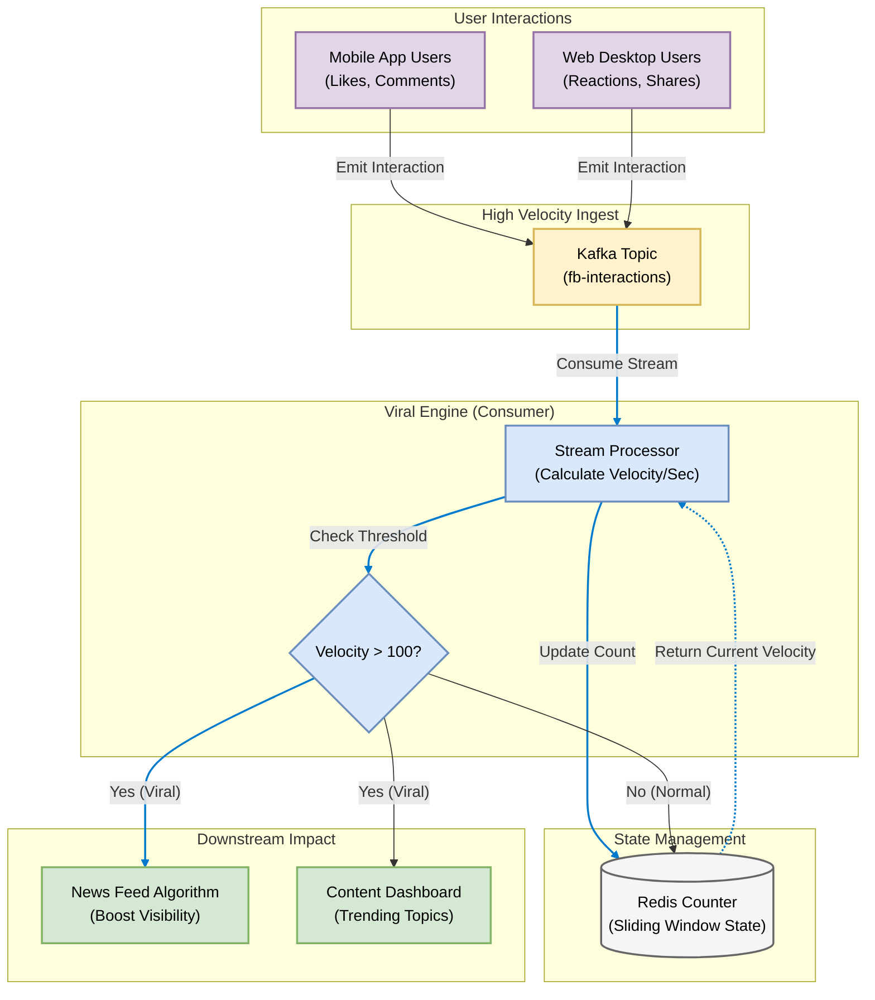

# Facebook: Real-Time Viral Content Detection

## 1. Problem Statement
With billions of posts daily, Facebook needs to instantly identify 'Viral' content to push it to users' News Feeds. Waiting for batch processing means missing the trend. We need a real-time stream processor to calculate 'Reaction Velocity'.

## 2. Requirements & KPIs
- Ingestion: Handle bursty traffic (e.g., Live Events, Breaking News).
- Velocity Tracking: Calculate interactions per second for every Post ID.
- Thresholding: If velocity > 100/sec, flag as 'Viral'.
- Reaction Types: Distinguish between 'Like' (Positive) and 'Angry' (Controversial).

## 3. Architecture & Pipeline
1. **Interaction Stream (Producer)**: Simulates user reactions (Like, Love, Angry).
2. **Ingest**: Kafka Topic `fb-interactions`.
3. **Velocity Engine (Consumer)**: 
   - Aggregates reactions in 2-second windows.
   - Flags posts exceeding the 'Viral Threshold'.
4. **Action**: Updates the Global Feed algorithm instantly.

---

## 4. Technical Implementation

### File Structure
- `producer.py`: Generates a high-velocity stream of Likes/Reactions.
- `consumer.py`: The Viral Engine. Detects spikes in post traffic.
- `utils_logger.py`: Logging config.

### Architecture Diagram: Facebook Viral Content Detection




### How to Run this Demo

**Step 1: Install Dependencies**
```bash
pip install -r requirements.txt
```

**Step 2: Start the Viral Engine (Consumer)**
This service monitors the stream for trends.
```bash
python consumer.py
```
*It will start listening for engagement spikes...*

**Step 3: Start the Traffic Generator (Producer)**
This simulates millions of users clicking 'Like'.
```bash
python producer.py
```

**Step 4: Observe Trends**
Watch the Consumer terminal. You will see:
- 📈 **Rising**: A post is gaining traction.
- 🚀 **VIRAL TREND DETECTED**: A post has exploded in popularity.

---
*Generated by Automation Script | Facebook: Real-Time Viral Content Detection Project*
