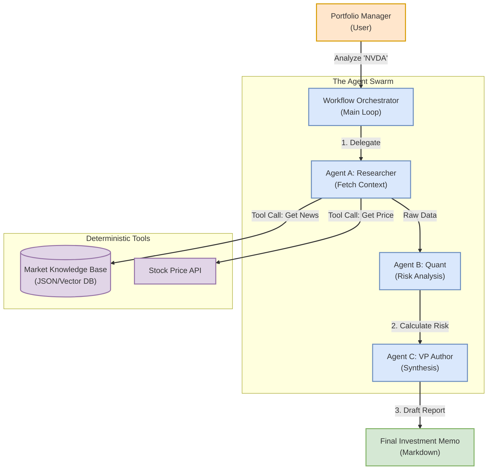

# Project 16: The Wall Street Swarm (Multi-Agent System)

## 1. Problem Statement
**The Challenge:** High-value financial analysis requires synthesizing data from disparate sources (news, 10-K filings, real-time pricing). Human analysts spend 80% of their time gathering data and only 20% analyzing it.

**The Solution:** An **Agentic Workflow** where specialized AI agents (Researcher, Quant, Writer) collaborate autonomously. This "Swarm" architecture reduces report generation time from hours to seconds while maintaining consistency.

## 2. Value Proposition (Why this matters to FinTech)
* **Decoupled Reasoning:** By splitting "Research" (Retrieval) from "Analysis" (Reasoning), we reduce hallucinations common in single-prompt LLMs.
* **Tool Use (Function Calling):** Demonstrates how Agents interact with deterministic systems (Databases/APIs) to ground their answers in fact.
* **Auditability:** Every step of the reasoning chain (Research -> Quant -> Writer) is logged, a requirement for regulated financial industries.

## 3. Architecture Diagram


## 4. Design & Approach
* **Pattern:** Sequential Chain of Thought (CoT) handoffs.
* **State Management:** Data is passed as a structured dictionary context between agents.
* **Tools:** Custom Python classes mimic API endpoints (e.g., `get_stock_price`), designed to be easily swapped for real Bloomberg/AlphaVantage APIs in production.

## 5. How to Run the Demo
1. **Navigate to the Source Directory:**
```bash
cd src
```

2. **Run the Swarm:**
```bash
python main.py
```

3. **Expected Output:**
   * You will see the Researcher fetch live mock data.
   * The Quant will assess the P/E ratio and assign a risk level.
   * The Writer will output a formatted Investment Memo recommending a "HOLD" or "BUY" strategy.

---
**Designed for High-Velocity FinTech Environments | Python 3.10+ | Zero External Dependencies**